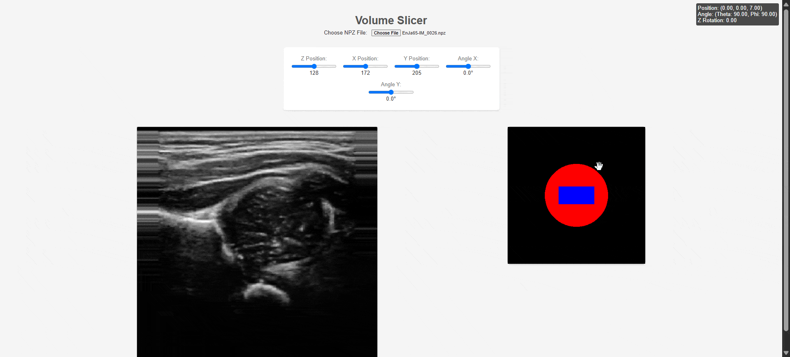

# Retuve Ultrasound Sweep Simulator (RUSS)

RUSS is a simulator for Ultrasound Sweeps using 3D Ultrasound Data. It is currently used for Hip Dysplacia in the [Retuve Project](https://github.com/radoss-org/retuve).

## Usage

RUSS has two main interfaces. One, is a single HTML file that can be opened in any browser. This allows for manual control through the 3D Ultrasound Sweep.



### Controls

- `Mouse down over blue rectangle` - Control movement into and left and right of the scan
- `W` - Move Up
- `S` - Move Down
- `A` - Rotate Left
- `D` - Rotate Right

The second interface is a Python API that allows for programmatic control of the sweep. This is useful for automating the sweep process.

```bash
pip install git+https://github.com/radoss-org/retuve-us-sweep-sim
```

```python
from us_sweep_sim import VolumeSlicer
slicer = VolumeSlicer(
    "my npz file.npz"
)
frame_parameters = slicer.create_synthetic_video(
    "synthetic_video.mp4",
)
```
